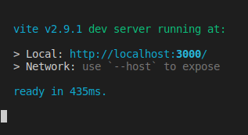

  

  

## Seja bem vindo ao repositório do projeto Ímpar Baby.
## Um projeto em React.js com uso de Vite, 
## Manipulação de estados com Redux , 
## Estilização com Styled Components , 
## API do Mercado Livre, e  Deploy no AWS Amplify.
  
### Como funciona:
### Para verificar o funcionamento na web, basta acessar:
#### https://main.d338seei1inw34.amplifyapp.com/

  
### Para verificar o funcionamento em sua maquina local:
#### Abre seu terminal e baixe essa aplicação com o comando:
#### git clone https://github.com/adrianoforcellini/frontendjr/

#### Entre na pasta do projeto, instale as dependências e inicie seu servidor com o comando:
#### cd frontendjr/impar && npm i && npm run dev 
  
#### Agora basta acessar http://localhost:3000/ ;D
#### ( Por padrão,o Vite executará a aplicação nesta porta, mas se ela estiver ocupada ele escolherá outra.)
#### Por via das dúvidas, basta verificar o output do terminal:
  

