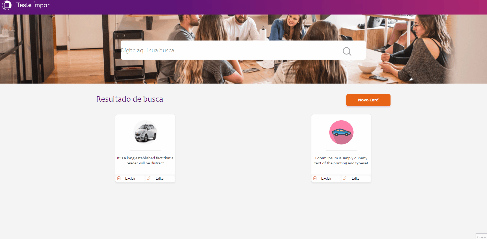
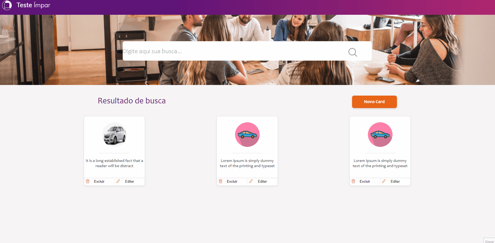

# Projeto Ímpar
Esse projeto foi feito em React e utilizado Firebase para o backend.
 
Tem o intuito de criação de cards com conteúdo de texto e uma imagem para sua referência.

# Instalação do projeto

1º Clone o repositório para sua máquina:
```
git clone https://github.com/bquintiliano/frontendjr.git

```

2º Acesse a pasta clonada e instale as dependências:
```
cd "caminho da pasta clone"
npm install

```
3º Após finalizar a instalação das dependências já é possível executar o projeto para utilização:
```
npm run start

```
4ª Se desejar realizar a publicação do projeto, utilize o comando abaixo para a criação dos arquivos para deploy dentro da pasta "build" que será criada após executar o comando:
```
npm run build

```
Copie o conteúdo da pasta "build" para seu Web Server.

# Utilizando o projeto
## Criando Cards:
Para criação dos Cards clique em "Novo Card" preencha o campo do Nome e selecione uma imagem correspondente. 



## Editar Cards:

Clicando em editar em um dos cards é possível atualizar o nome do Card ou a sua foto.



## Excluir Cards:

Clicando em excluir em um dos cards é possível remover ele da listagem.


## Pesquisa de Cards:

No campo de busca é possível localizar os cards da listagem, é necessário inserir o nome exato do Card.


# Considerações do teste:

Configuração do firebase exposta para o funcionamento do teste, banco em modo de desenvolvimento.

